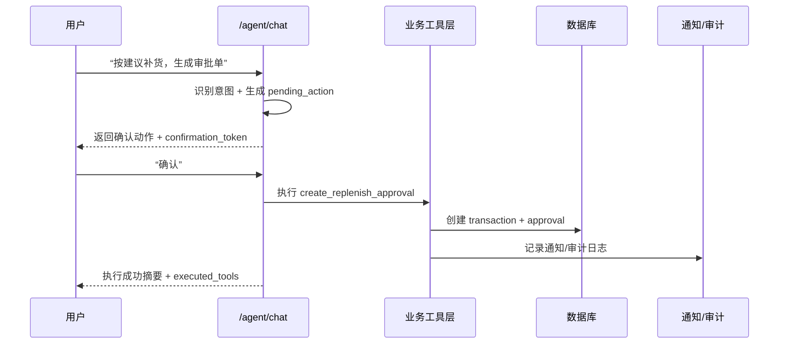

# 决赛答辩证据链（P3-3）

## 1. 一句话价值

本项目把“共享设备/物料管理系统”升级为“可执行治理的智能体中枢”，不仅能回答问题，还能提出动作、确认执行、闭环追踪，并给出可量化改进证据。

## 2. 问题-方案-结果映射

| 问题 | 方案 | 结果证据 |
|---|---|---|
| 资源利用率不高、排程冲突频繁 | 智能排程 + 公平治理策略（黄金时段配额、连续占用限制、高频降权） | `GET/PATCH /scheduler/fairness-policy`、`/scheduler/optimal-slots` 返回 `fairness_penalty` |
| 耗材浪费与工具丢失难闭环 | 证据链规则 + 异常自动建任务 + 主动通知 | `evidence_backfill` 任务、`GET /notifications/deliveries` |
| 多能力分散、评审难感知“智能体” | 多智能体协作（调度/治理/证据）+ 可解释链路 | `POST /enhanced-agent/ask` 返回 `multi_agent_trace` 与 `analysis_steps` |
| 改进无法量化 | KPI 看板 + 智能体能力评测集 | `GET /analytics/kpi-dashboard` + `py -m agent_eval.run_eval` |

## 3. 架构图

```mermaid
flowchart LR
    U[学生/教师/管理员] --> FE[dashboard-main]
    FE --> A1[/agent/chat]
    FE --> A2[/enhanced-agent/ask]
    FE --> K[/analytics/kpi-dashboard]
    FE --> R[/system/readiness]

    A2 --> O[主代理编排器]
    O --> SA[调度代理]
    O --> GA[治理代理]
    O --> EA[证据代理]
    SA --> SVC1[smart_scheduler]
    GA --> SVC2[fairness_policy + follow_up]
    EA --> SVC3[evidence_policy + inventory_vision]

    A1 --> TOOLS[业务动作工具]
    TOOLS --> TX[transactions/approvals]
    TOOLS --> TASK[follow_up_tasks]
    TOOLS --> AL[alerts/notifications/audit_logs]

    TX --> DB[(SQLite)]
    TASK --> DB
    AL --> DB
    K --> DB
```

## 4. 核心流程图（智能体执行闭环）



## 5. 指标图（评测与量化）

### 5.1 智能体能力评测集

- 命令：`py -m agent_eval.run_eval --output docs/reports/agent_eval_latest.json --fail-under 100`
- 覆盖：问答、执行、拒绝、澄清、异常处理
- 当前结果：`7/7` 通过，`score=100.00`

### 5.2 KPI 看板（30天窗口）

| 指标 | 当前值 | 基线值 | 趋势 |
|---|---:|---:|---|
| 利用率 utilization_rate | 0.0034 | 0.0 | improved |
| 逾期率 overdue_rate | 1.0 | 0.0 | declined |
| 浪费率 waste_rate | 0.0 | 0.0 | stable |
| 报失率 loss_rate | 0.0 | 0.0 | stable |
| 公平指数 fairness_index | 1.0 | 1.0 | stable |

注：以上为 `2026-04-12` 本地快照，现场以实时导出结果为准。

## 6. 证据导出与展示入口

1. 导出报告：`py -m scripts.finals.export_defense_reports --output-dir docs/reports --kpi-days 30`
2. 运行总验收：`py -m scripts.finals.run_release_checks --output docs/reports/finals_release_check.json`
3. 一键流水线：`py -m scripts.finals.run_finals_pipeline --output-dir docs/reports --kpi-days 30`
4. 核心文件：
- `docs/reports/agent_eval_latest.json`
- `docs/reports/kpi_dashboard_latest.json`
- `docs/reports/defense_reports_summary.json`
- `docs/reports/finals_release_check.json`
- `docs/reports/finals_pipeline_summary.json`
5. 比赛要求核查文档：
- `docs/finals/2026-04-12-competition-requirements-checklist.md`
6. 展示页面：
- `GET /dashboard-main`
- `GET /system/readiness`
- `POST /enhanced-agent/ask`
- `GET /analytics/kpi-dashboard`

## 7. 失败兜底（回退方案）

- 若外部 LLM 不可用：回退规则引擎与业务工具（核心链路仍可演示）。
- 若网络波动：优先本地 Swagger + dashboard + 本地 SQLite 数据演示。
- 若现场时间不足：按“主链路四步”快速演示：`readiness -> agent action confirm -> enhanced-agent trace -> KPI+agent_eval`。
